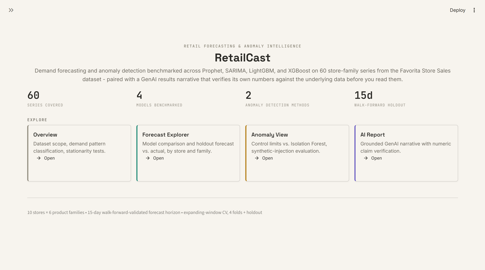
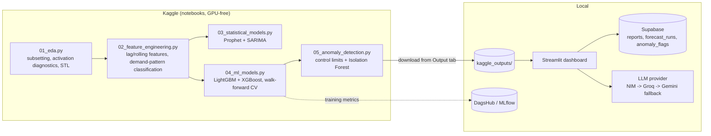

# RetailCast: Forecasting and Anomaly Insights

A retail demand forecasting and anomaly detection pipeline that benchmarks four models
against each other and hands the results to an LLM to write up, then makes the LLM prove
its own numbers before you ever see them, every claim it writes is checked against the
same source data it was given, not taken on faith.

Built on the [Favorita Store Sales](https://www.kaggle.com/competitions/store-sales-time-series-forecasting)
dataset (10 stores x 6 product families, 60 series), benchmarked across Prophet, SARIMA,
LightGBM, and XGBoost with expanding-window walk-forward cross-validation. Runs on
free-tier infrastructure throughout: Kaggle's free notebooks for all training compute (no
GPU needed, none of these models require one), Supabase's free Postgres tier for storage,
and free-tier NIM/Groq/Gemini API access for the narrative layer, with automatic fallback
across all three so a single provider's rate limit doesn't stall the report.

The project is split into two stages: heavy compute (EDA, feature engineering, model
training, anomaly detection) runs on Kaggle notebooks; a lightweight Streamlit dashboard
runs locally against the downloaded results, with an LLM layer that generates a narrative
report and checks its own numeric claims against the source data before showing it to you.
Every generated report is saved to Supabase automatically and can also be downloaded
directly from the dashboard as a Markdown file, both for the report you just generated and
for any past report in history.

## Preview

<p align="center">
  
  <br>
  <sub><em>Home page: dataset scope at a glance, and the four views the dashboard is split
  into. Card color is a legend used throughout the app, gray for dataset/config, teal for
  forecast results, amber for anomaly results, violet for AI-generated content, so you can
  always tell what kind of content you're looking at without reading a label.</em></sub>
</p>

## Architecture



## Results at a glance

**Forecasting (holdout, most recent 15 days):**

| Model | MASE | MAPE | WAPE |
|---|---|---|---|
| **XGBoost** (best) | **0.632** | 15.23% | 11.76% |
| LightGBM | 0.674 | 15.32% | 12.55% |
| SARIMA (3-series avg) | 1.019 | 15.72% | 17.60% |
| Prophet (60-series avg) | 1.001 | 18.18% | 18.34% |

A single global tree model pooling across all 60 series beats per-series statistical
models on average error, at the cost of losing series-specific interpretability. Prophet
and SARIMA both land near or above MASE 1.0, meaning on average they're roughly on par
with or worse than a naive lag-7 seasonal baseline on this holdout window.

**Anomaly detection (synthetic-injection evaluation):**

| Method | Precision | Recall | F1 |
|---|---|---|---|
| Control limits (k=2.5) | 0.581 | **0.86** | **0.694** |
| Isolation Forest (5% contamination) | **0.667** | 0.60 | 0.632 |

Control limits catch more true anomalies (higher recall) at the cost of more false
positives. Isolation Forest is stricter and misses more. Isolation Forest's recall is
structurally capped by its fixed contamination rate, independent of the true anomaly rate.

**Illustrative cost-of-error framing (holdout, USD):** XGBoost ~$193,153 vs. LightGBM
~$206,145 in estimated cost of forecast error, using published grocery-retail margin
benchmarks, not verified P&L data (see Known limitations). Saved to `cost_of_error.json` by
notebook 4 and surfaced in the AI Report's facts, like every other number here.

## Tech stack

- **Modeling:** Prophet, statsmodels (SARIMAX), LightGBM, XGBoost, scikit-learn (IsolationForest)
- **Experiment tracking:** MLflow via DagsHub
- **Dashboard:** Streamlit + Altair (Altair ships with Streamlit, so custom charts add
  zero extra dependencies over the built-in `st.bar_chart`/`st.line_chart`)
- **Storage:** Supabase (Postgres)
- **LLM narrative:** NVIDIA NIM / Groq / Google Gemini, with automatic fallback

## Dashboard design

`dashboard/theme.py` defines the tokens (color, type) and small render helpers every page
uses, so the app reads as one product instead of five independently-styled pages. The one
idea worth knowing about: **card color is a legend, not decoration.** Every card gets a
3px left edge, and the color means the same thing on every page:

| Color | Means |
|---|---|
| Gray | Dataset / configuration - what was actually run |
| Teal | Forecast results - model output, backtested |
| Amber | Anomaly detection results - flags, control limits |
| Violet | AI-generated narrative - the one thing in the app that's generated rather than directly computed |

That last one matters most: the AI Report page's whole premise is that you can tell
generated content apart from verified data, so it's the only page where anything gets a
violet border. Numbers are set in monospace throughout, since this is a numbers-dense
review tool and aligned digits are easier to scan and compare than proportional ones.

## Project structure

```
retailcast/
│
├── kaggle/                               # Everything that runs on Kaggle, not locally
│   ├── kaggle_setup.md                   # env setup, secrets, run order
│   ├── requirements-ipynb.txt            # single source of truth, installed via !pip install on Kaggle
│   └── notebooks/
│       ├── 01_eda.ipynb                  # subsetting, activation diagnostics, STL, stationarity tests
│       ├── 02_feature_engineering.ipynb  # lag/rolling/calendar features, demand-pattern classification
│       ├── 03_statistical_models.ipynb   # Prophet (60 series) + SARIMA deep-dive (3 series)
│       ├── 04_ml_models.ipynb            # global LightGBM + XGBoost, walk-forward CV, MLflow/DagsHub
│       └── 05_anomaly_detection.ipynb    # control limits + Isolation Forest, synthetic-anomaly eval
│
├── kaggle_outputs/                       # Downloaded from Kaggle's Output tab after each run
│
├── src/                                  # LOCAL-ONLY modules, imported by the dashboard
│   ├── llm/
│   │   ├── narrative.py                  # prompt construction + provider routing (NIM -> Groq -> Gemini)
│   │   └── grounding_check.py            # regex-extract numeric claims, verify against source facts
│   ├── storage/
│   │   └── supabase_client.py            # save/fetch forecast runs, reports, anomaly flags
│   ├── tracking/
│   │   └── mlflow_utils.py               # (optional) query past DagsHub/MLflow runs for the dashboard
│   └── utils/
│       ├── config.py                     # loads configs/config.yaml, env vars
│       └── metrics.py                    # MAPE/WAPE/MASE - single source, used by dashboard + tests
│
├── dashboard/
│   ├── app.py                            # st.navigation router: page titles/icons/order, page_config
│   ├── theme.py                          # design tokens + CSS/Altair helpers shared by all 5 pages
│   └── views/
│       ├── home.py                       # landing page, nav cards to each view
│       ├── overview.py                   # dataset scope, demand pattern classification, stationarity
│       ├── forecast_explorer.py          # model comparison, per store/family forecast vs actual
│       ├── anomaly_view.py               # flagged anomalies, control-limit vs IsoForest comparison
│       └── ai_report.py                  # GenAI narrative, key-metric charts, grounding-check status
│
├── .streamlit/
│   └── config.toml                       # theme: light base, matches dashboard/theme.py tokens
│
├── configs/
│   └── config.yaml                       # selected stores/families, horizon, CV folds, cost-per-unit, thresholds
│
├── docs/
│   └── screenshots/                      # referenced in the Preview section above
│
├── tests/
│
├── .env.example                          # NIM/Groq/Gemini API keys, Supabase URL + key, DagsHub token + URL
├── .gitignore
├── requirements.txt                      # Streamlit, Supabase, pyyaml, python-dotenv (LLM
│                                          #   providers are called directly via requests, no SDKs)
└── README.md                             # architecture diagram, setup instructions, results summary
```

## Getting started

### 1. Kaggle phase

Run `kaggle/notebooks/01_eda.ipynb` through `05_anomaly_detection.ipynb` in order on
Kaggle, attaching each notebook's output as the input source for the next (see
`kaggle/kaggle_setup.md`). Download all 14 output files from each notebook's Output tab
into a local `kaggle_outputs/` folder at the repo root.

### 2. Local dependencies

```bash
pip install -r requirements.txt
pip install pytest
```

### 3. Environment variables

```bash
cp .env.example .env
```

Fill in at least one LLM provider key (`NIM_API_KEY` / `GROQ_API_KEY` / `GEMINI_API_KEY`)
and your Supabase **secret** key (this runs server-side, not in a browser).

### 4. Supabase tables

Run in the Supabase SQL editor:

```sql
create table reports (
  id uuid primary key default gen_random_uuid(),
  created_at timestamptz default now(),
  report_text text not null,
  facts jsonb not null,
  provider text not null,
  grounding_ratio float8 not null
);

create table forecast_runs (
  id uuid primary key default gen_random_uuid(),
  created_at timestamptz default now(),
  model text not null,
  fold text not null,
  mape float8,
  wape float8,
  mase float8
);

create table anomaly_flags (
  id uuid primary key default gen_random_uuid(),
  created_at timestamptz default now(),
  date date not null,
  store_nbr int not null,
  family text not null,
  sales float8,
  forecast float8,
  residual float8,
  control_limit_flag int,
  isoforest_flag int
);
```

## Running it

```bash
streamlit run dashboard/app.py
```

The dashboard opens on the home page shown above. From there: **Overview** for dataset
scope and demand-pattern classification, **Forecast Explorer** for the model comparison
and per-store/family forecast vs. actual, **Anomaly View** for control-limit vs. Isolation
Forest flags, and **AI Report** to generate the narrative brief, watch its grounding ratio,
and download it as Markdown. Every chart and number on every page is read directly from
`kaggle_outputs/`, nothing in the dashboard is computed ad hoc from a different source
than what the notebooks produced.

## Testing

```bash
pytest tests/ -v
```

Covers `MAPE`/`WAPE`/`MASE` correctness (`tests/test_metrics.py`), the numeric claim
extraction/tolerance logic behind the grounding check (`tests/test_grounding_check.py`),
and that `configs/config.yaml` hasn't silently drifted from the constants hardcoded in the
Kaggle notebooks (`tests/test_config_consistency.py`).

## Known limitations

- **Backtesting, not live forecasting.** Every model is evaluated on a 15-day holdout
  window that already has known actuals. There's no production path that generates
  predictions for genuinely unseen future dates, that would need retraining on the full
  history and recursive multi-step forecasting (lag features depend on actual past sales,
  which don't exist yet for real future dates). This was a deliberate scope boundary, not
  an oversight.
- **`is_holiday` is national-only.** Regional/local holidays tied to a specific store's
  city aren't captured.
- **Cost-per-unit figures are illustrative**, grounded in published grocery-retail margin
  benchmarks, not this business's actual P&L.
- **The grounding check is regex-based**, not full claim verification. It can miss
  paraphrased claims with no literal number, and can flag numbers that are correct but
  simply aren't in the source facts.
- **`configs/config.yaml` doesn't drive the Kaggle notebooks.** They run in a separate
  environment and hardcode the same values independently (horizon, folds, control-limit
  k, contamination rate, cost-per-unit). `tests/test_config_consistency.py` checks the two
  haven't drifted apart, but it's a manual mirror, not a shared source of truth, update
  both together if you change a modeling parameter.
