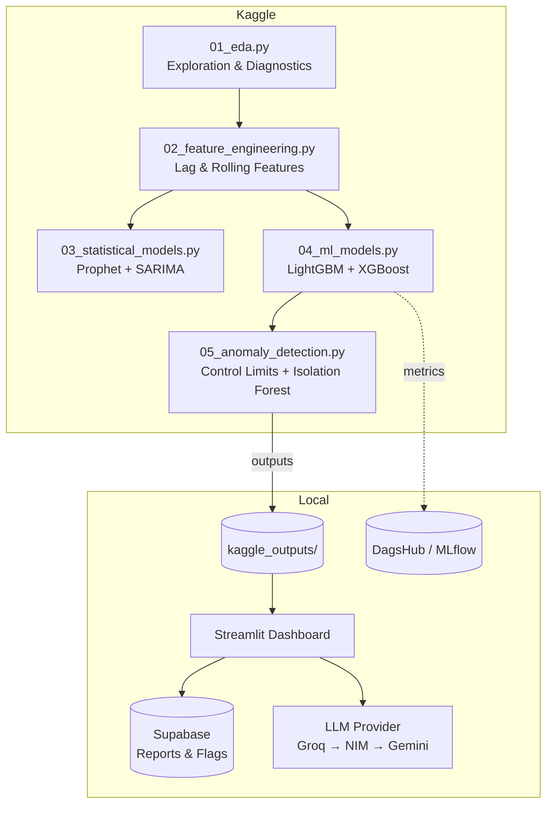

# RetailCast: Forecasting and Anomaly Bench

A retail demand forecasting and anomaly detection pipeline that benchmarks Prophet, SARIMA, LightGBM, and XGBoost across 60 retail series using expanding-window walk-forward cross-validation. It uses Kaggle’s free notebooks for training, Supabase’s free Postgres tier for storage, and free-tier Groq/NIM/Gemini APIs for automated reporting with provider fallback.

The project separates heavy computation from a lightweight local Streamlit dashboard. The LLM generates narrative reports and verifies every numeric claim against the original source data before displaying it. Reports are automatically saved to Supabase and can be downloaded as Markdown, including previous reports from the dashboard’s history.


## Preview

<p align="center">
  
  <br>
  <sub>Anomaly Detection view (Synthetic-Injection evaluation)</sub>
</p>

> Additional screenshots in [`assets/`](assets/), one per dashboard view.

## Architecture



## Results at a glance

**Forecasting (holdout, most recent 15 days):**

| Model | MASE | MAPE | WAPE |
|---|---|---|---|
| **XGBoost** (best) | **0.632** | 15.23% | 11.76% |
| LightGBM | 0.674 | 15.32% | 12.55% |
| SARIMA (3-series avg) | 1.019 | 15.72% | 17.60% |
| Prophet (60-series avg) | 1.001 | 18.18% | 18.34% |

A single global tree model pooling across all 60 series beats per-series statistical models on average error, at the cost of losing series-specific interpretability. Prophet and SARIMA both land near or above MASE 1.0, meaning on average they're roughly on par with or worse than a naive lag-7 seasonal baseline on this holdout window.

**Anomaly detection (synthetic-injection evaluation):**

| Method | Precision | Recall | F1 |
|---|---|---|---|
| Control limits (k=2.5) | 0.581 | **0.86** | 0.694 |
| Isolation Forest (5% contamination) | **0.867** | 0.78 | **0.821** |

Isolation Forest now has both far fewer false positives and the higher F1, once its evaluation features are scaled from clean (pre-injection) statistics instead of stats computed on the injected data itself. Control limits still catches slightly more of the injected anomalies (higher recall), at the cost of a lot more false positives. Isolation Forest's recall is structurally capped by its fixed contamination rate, independent of the true anomaly rate.

**Illustrative cost-of-error framing (holdout, USD):** XGBoost ~$193,153 vs. LightGBM ~$206,145 in estimated cost of forecast error, using published grocery-retail margin benchmarks, not verified P&L data (see Known limitations). Saved to `cost_of_error.json` by notebook 4 and surfaced in the AI Report's facts, like every other number here.

## Tech stack

- **Modeling:** Prophet, statsmodels (SARIMAX), LightGBM, XGBoost, scikit-learn (IsolationForest)
- **Experiment tracking:** MLflow via DagsHub
- **Dashboard:** Streamlit + Altair (Altair ships with Streamlit, so custom charts add
  zero extra dependencies over the built-in `st.bar_chart`/`st.line_chart`)
- **Storage:** Supabase (Postgres)
- **LLM narrative:** Groq / NVIDIA NIM / Google Gemini, with automatic fallback

## Project structure

```
retailcast-project/
├── kaggle/                               # Everything that runs on Kaggle, not locally
│   ├── kaggle_setup.md                   # env setup, secrets, run order
│   ├── requirements-ipynb.txt            # pinned-version reference for debugging installs; each notebook's own inline !pip install line is what actually runs
│   └── notebooks/
│       ├── 01_eda.ipynb                  # subsetting, activation diagnostics, STL, stationarity tests
│       ├── 02_feature_engineering.ipynb  # lag/rolling/calendar features, demand-pattern classification
│       ├── 03_statistical_models.ipynb   # Prophet (60 series) + SARIMA deep-dive (3 series)
│       ├── 04_ml_models.ipynb            # global LightGBM + XGBoost, walk-forward CV, MLflow/DagsHub
│       └── 05_anomaly_detection.ipynb    # control limits + Isolation Forest, synthetic-anomaly eval
│
├── kaggle_outputs/                       # Downloaded from Kaggle's Output tab after each run
│
├── src/                                  # LOCAL-ONLY modules, imported by the dashboard
│   ├── llm/
│   │   ├── narrative.py                  # prompt construction + provider routing (Groq -> NIM -> Gemini)
│   │   └── grounding_check.py            # regex-extract numeric claims, verify against source facts
│   ├── storage/
│   │   └── supabase_client.py            # save/fetch forecast runs, reports, anomaly flags
│   ├── tracking/
│   │   └── mlflow_utils.py               # queries past DagsHub/MLflow runs, surfaced in forecast_explorer.py
│   └── utils/
│       ├── config.py                     # loads configs/config.yaml, env vars
│       └── metrics.py                    # MAPE/WAPE/MASE - single source of truth, see scripts/sync_notebook_metrics.py
│
├── scripts/
│   ├── sync_notebook_metrics.py          # propagates src/utils/metrics.py into the two notebooks that can't import it
│   ├── smoke_test_notebook_fixes.py      # runs the notebooks' anomaly/run_fold fixes against synthetic data (no Kaggle needed)
│   └── _notebook_utils.py                # shared .ipynb JSON <-> source helpers used by the two scripts above
│
├── dashboard/
│   ├── app.py                            # st.navigation router: page titles/icons/order, page_config
│   ├── theme.py                          # design tokens + CSS/Altair helpers shared by all 5 pages
│   └── views/
│       ├── home.py                       # landing page, nav cards to each view
│       ├── overview.py                   # dataset scope, demand pattern classification, stationarity
│       ├── forecast_explorer.py          # model comparison, per store/family forecast vs actual, MLflow run history
│       ├── anomaly_view.py               # flagged anomalies, control-limit vs IsoForest comparison
│       └── ai_report.py                  # GenAI narrative, key-metric charts, grounding-check status
│
├── .streamlit/config.toml                # theme: light base, matches dashboard/theme.py tokens
├── assets/                               # screenshots and images of views
├── configs/config.yaml                   # selected stores/families, horizon, CV folds, cost-per-unit, thresholds
│
├── tests/
│
├── .env.example                          # Groq/NIM/Gemini API keys, Supabase URL + key, DagsHub token + URL
├── .gitignore
├── requirements.txt
└── README.md                             # architecture diagram, setup instructions, results summary
```

## Getting started

### 1. Kaggle phase

Run `kaggle/notebooks/01_eda.ipynb` through `05_anomaly_detection.ipynb` in order on Kaggle, attaching each notebook's output as the input source for the next (see `kaggle/kaggle_setup.md`). Download all 14 output files from each notebook's Output tab into a local `kaggle_outputs/` folder at the repo root.

### 2. Local dependencies

```bash
pip install -r requirements.txt
pip install pytest
```

### 3. Environment variables

```bash
cp .env.example .env
```

Fill in at least one LLM provider key (`GROQ_API_KEY` / `NIM_API_KEY` / `GEMINI_API_KEY`) and your Supabase **secret** key (this runs server-side, not in a browser). `DAGSHUB_TOKEN` / `DAGSHUB_REPO` are optional - without them the dashboard works normally, just without the "Experiment history" section on Forecast Explorer.

### 4. Supabase tables

Run in the Supabase SQL editor:

```sql
create table reports (
  id uuid primary key default gen_random_uuid(),
  created_at timestamptz default now(),
  report_text text not null,
  facts jsonb not null,
  provider text not null,
  grounding_ratio float8 not null
);

create table forecast_runs (
  id uuid primary key default gen_random_uuid(),
  created_at timestamptz default now(),
  model text not null,
  fold text not null,
  mape float8,
  wape float8,
  mase float8
);

create table anomaly_flags (
  id uuid primary key default gen_random_uuid(),
  created_at timestamptz default now(),
  date date not null,
  store_nbr int not null,
  family text not null,
  sales float8,
  forecast float8,
  residual float8,
  control_limit_flag int,
  isoforest_flag int
);
```

## Running it

```bash
streamlit run dashboard/app.py
```

Every chart and number on every page is read directly from `kaggle_outputs/`, nothing in the dashboard is computed ad hoc from a different source than what the notebooks produced.

## Testing

```bash
pytest tests/ -v
```

If you change `src/utils/metrics.py`, run `python scripts/sync_notebook_metrics.py` before
committing - it propagates the change into the two Kaggle notebooks that keep their own
copy (they can't `import src.utils.metrics`), and `tests/test_notebook_metrics_sync.py`
will fail the suite if you forget.

20 tests across 5 files: `MAPE`/`WAPE`/`MASE` correctness, the numeric claim extraction/tolerance logic behind the grounding check, including which fact grounded a claim, config/notebook-constant drift, including the cost-per-unit and sustained-activation constants, byte-for-byte drift between `src/utils/metrics.py` and its two notebook copies, and the notebook-level anomaly-injection/`run_fold` fixes against synthetic data.

## Known limitations

- **Backtesting, not live forecasting.** Every model is evaluated on a 15-day holdout window that already has known actuals. This was a deliberate scope boundary, not an oversight.
- **`is_holiday` is national-only.** Regional/local holidays tied to a specific store's city aren't captured.
- **Cost-per-unit figures are illustrative**, grounded in published grocery-retail margin benchmarks, not this business's actual P&L.
- **The grounding check is regex-based**, not full claim verification. It can miss paraphrased claims with no literal number, and can flag numbers that are correct but simply aren't in the source facts. It also matches a claim against whichever fact value is numerically closest, not necessarily the fact the claim is actually about - a hallucinated figure can still "ground" against an unrelated correct one.
- **The forecast comparison mixes evaluation scope.** LightGBM/XGBoost and Prophet are scored across all 60 series; SARIMA's grid search only runs on 3 representative series for CPU cost. Forecast Explorer now shows an `n_series` column so this isn't hidden inside the "avg" label.